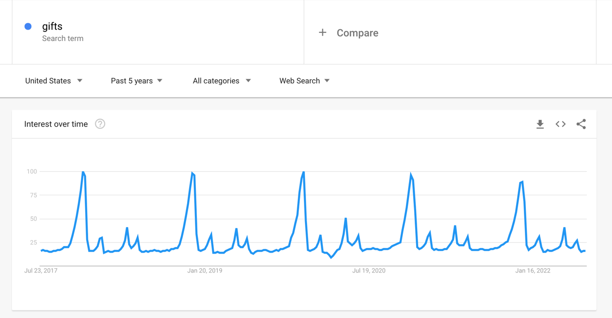
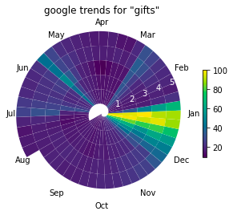
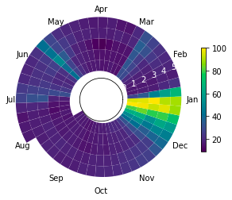

Let's use for example Google Trends results for the search term "gifts."
Google offers this plot:



It should be no surprise that these results show a cyclical trend
and it looks like this might be an annual cycle with the max around 
Christmas time. It can be hard to create visualizations that bring out
this cyclic pattern. Stacking years on top of each other will require
you to break the year at a certain point, breaking continuous data and
potentially creating the impression of two different spikes when there
is really just one.


I have created way to plot cyclic that I call a "spiral plot."
The data starts at the center of a circle and proceeds out in a spiral.
Each year of time forms a ring around the spiral so that a given angle 
of the circle has data from the same time of year on every loop. Here
is the google trend for "gifts" shown as a spiral plot:

{:class="img-responsive"}

This plot is more compact than the line version and may highlight some trends
more clearly. The drawback of this approach is that earlier years are smaller
than more recent years. You can make this less dramatic by giving the circle an
empty center (setting `origin=-2`).



Code:

```python
from typing import Optional

import matplotlib.pyplot as plt
import numpy as np
from matplotlib.collections import PatchCollection
from matplotlib.patches import Polygon

def spiral_plot(
    data,
    num_cycles: int,
    num_points_per_seg: int = 100,
    angle: float = 0.,
    origin: float = 0.,
    cmap=None,
    show_legend: bool = True,
    ax: Optional[plt.Axes] = None
):
    
    if ax is None:
        _, ax = plt.subplots(subplot_kw={'projection': 'polar'})
    
    n_segments = len(data)
    num_points = num_points_per_seg * n_segments
    
    inner_rs = np.linspace(0, num_cycles, num_points)
    outer_rs = inner_rs + 1
    thetas = np.linspace(0, 2*np.pi*num_cycles, num_points) + angle

    patches = []
    for i in range(n_segments):
        tt = np.hstack(
            (
                thetas[i*num_points_per_seg:(i+1)*num_points_per_seg],
                thetas[i*num_points_per_seg:(i+1)*num_points_per_seg][::-1]
            )
        )
        rr = np.hstack(
            (
                inner_rs[i*num_points_per_seg:(i+1)*num_points_per_seg],
                outer_rs[i*num_points_per_seg:(i+1)*num_points_per_seg][::-1]
            )
        )
        patch = Polygon(np.c_[tt, rr])
        patches.append(patch)

    patches = PatchCollection(patches, cmap=cmap)
    patches.set_array(data)
    ax.add_collection(patches)
    
    ax.set_rlim((None, num_cycles+1))
    ax.grid(False)
    
    ax.set_rorigin(origin)
    
    if show_legend:
        ax.figure.colorbar(patches, shrink=0.6)
        
    ax.spines.polar.set_visible(False)
    ax.spines.inner.set_visible(False)
    
    return ax, patches

# Example usage
import pandas as pd

# data from any google trend
fpath = "multiTimeline.csv"
trend = "gifts"

data = pd.read_csv(fpath, header=1)[f"{trend}: (United States)"].values

ax, patches = spiral_plot(data, 5, angle=2*np.pi*7/12)

# make it prettier
ax.set_xticklabels(["Jan", "Feb", "Mar", "Apr", "May", "Jun", "Jul", "Aug", "Sep", "Oct", "Nov", "Dec"])
ax.set_xticks([2*np.pi*i/12 for i in range(0, 12)])
ax.tick_params(axis='x', which='major', pad=-5)
ax.tick_params(axis='y', colors='white')
```