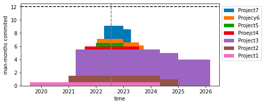

Matplotlib provides a
[stackplot](https://matplotlib.org/stable/api/_as_gen/matplotlib.pyplot.stackplot.html),
which stacks area, and a [step plot](https://matplotlib.org/stable/api/_as_gen/matplotlib.pyplot.step.html),
which provides steps, but there is no stacked step plot. This is useful
when you have some accumulating resource that have different types that
begin and end all at once. I personally had a need for this when I wanted
to visualize my man-month commitment to my company's funded projects over
the next 7 years.

```python
from itertools import chain

import numpy as np
import matplotlib.pyplot as plt

def plot_stacked_step(x, y, names, ax=None, sort=True):
    x_in = x
    y_in = y

    if sort:
        idx = np.argsort([x[0] for x in x_in])
        x_in = np.asarray(x_in)[idx]
        y_in = np.asarray(y_in)[idx]

    if ax is None:
        fig, ax = plt.subplots(figsize=(7, 3))

    all_x = sorted(set(chain(*x_in)))

    all_adj_y = []
    for xs, ys in zip(x_in, y_in):
        new_y = 0
        iy = 0

        adj_y = []
        for x in all_x:
            if x in xs:
                new_y = ys[iy] if iy < len(ys) else 0
                adj_y.append(new_y)
                iy += 1
            else:
                adj_y.append(new_y)

        all_adj_y.append(adj_y)

    stacked = np.cumsum(all_adj_y, axis=0)

    for name, i_stacked in list(zip(names, stacked))[::-1]:
        ax.fill(
            np.repeat(all_x, 2),
            np.hstack((0, np.repeat(i_stacked, 2)))[:-1],
            label=name,
        )

    return ax
```

Example usage (fake data)
```python
from datetime import datetime

data = [
    {
        "name": "Project1",
        "start-stop": [datetime(2021,4,1), datetime(2026, 2, 28)],
        "man-months": 4, 
    },
    {
        "name": "Project2",
        "start-stop": [datetime(2022, 1, 1), datetime(2022,12,31)],
        "man-months": 0.5,
    },
    {
        "name": "Project3",
        "start-stop": [datetime(2019, 8, 1), datetime(2024, 4, 30)],
        "man-months": 0.5,
    },
    {
        "name": "Proejct4",
        "start-stop": [datetime(2022, 4, 15), datetime(2023, 4, 14)],
        "man-months": 2.,
    },
    {
        "name": "Project5",
        "start-stop": [datetime(2021, 1, 1), datetime(2024, 12, 31)],
        "man-months": 1,
    },
    {
        "name": "Projecy6",
        "start-stop": [datetime(2021, 8, 1), datetime(2023, 7, 31)],
        "man-months": 0.5
    },
    {
        "name": "Project7",
        "start-stop": [datetime(2022, 1, 10), datetime(2023, 9, 30)],
        "man-months": 0.58,
    },
]

ax = plot_stacked_step(
    [x["start-stop"] for x in data],
    [[x["man-months"]] for x in data],
    [x["name"] for x in data],
)

ax.set_xlabel("time")
ax.set_ylabel("man-months commited")
ax.legend(bbox_to_anchor=(1, 1))
ax.axhline(12, ls='--', color='k')
ax.axvline(datetime.now(), ls='--', color=[.5, .5, .5])
ax.set_ylim((0, 12.5))
```

