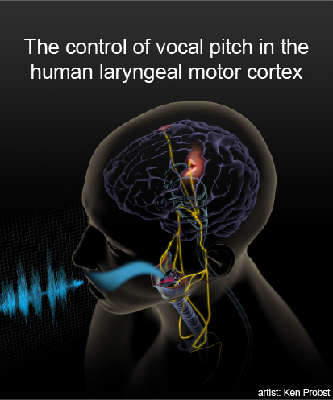

I am a neural data engineer working across labs and institutions to distribute analytic tools and accelerate scientific discovery. My focus is building and distributing tools for more productive data sharing between labs.

<table class="wide">
<tr>
  <td class="left">
    
  </td>
  <td class="right" width="50%">
    
  </td>
</tr>
</table>

  

      <ul class="nav">
          <li><a href="assets/Dichter_cv.pdf">cv</a></li>
          <li><a href="https://github.com/bendichter">github</a></li>
          <li><a href="https://www.linkedin.com/in/bendichter/">linkedin</a></li>
          <li><a href="{{ site.baseurl }}/pages/about.html#contact">contact</a></li>
      </ul>
  

