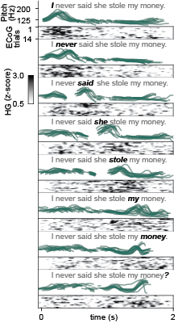

  

      <ul class="nav">
          <li><a href="assets/dichter_cv.pdf">cv</a></li>
          <li><a href="https://github.com/bendichter">github</a></li>
          <li><a href="https://www.linkedin.com/in/bendichter/">linkedin</a></li>
          <li><a href="{{ site.baseurl }}/pages/about.html#contact">contact</a></li>
      </ul>
  

<table class="wide">
<tr>
  <td class="left">
    brokenaxes: python package for creating matplotlib plots with broken axes
    
  </td>
  <td class="right">
    The neural control of the larynx in humans
    
  </td>
</tr>
</table>
