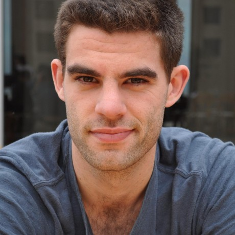

Ben Dichter is a data scientist consultant for neuroscience labs. He focuses on building systems for sharing of data and analyses.

[curriculum vitae ]({{ BASE_PATH }}/assets/dichter_cv.pdf) 
[orcid](http://orcid.org): [0000-0002-4914-6671](https://orcid.org/0000-0001-5725-6910) 
[google scholar](https://scholar.google.com/citations?user=_IwI_oEAAAAJ&hl=en&oi=ao) 
[impactstory](https://impactstory.org/u/0000-0002-4914-6671)

---

<h4>contact</h4>

    

        

            Ben Dichter 

            

            Email: <code>ben.di</code><b>I</b><code>chter</code><b>don't</b><code>@</code><b>want</b><code>bio</code><b>spam!
            </b><code>gmail</code><b>So</b><code>.</code><b>please</b><code>co</code><b>leave
            </b><code>m</code>
            

        

        

        
        

    

