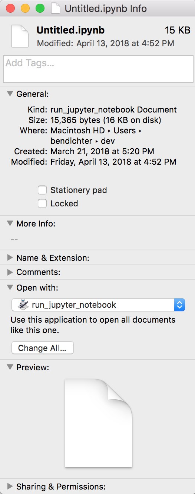

# Making it easy to launch a jupyter notebook

If you use jupyter as much as I do, this steps to run a notebook are probably second nature, but if you take a step back, it involves a lot of prior knowledge. A few times I've tried to bring brand new eager programmers into the glorious land of python and jupyter, but each time I found that the whole flow was really bogged down my this extensive preamble that is pretty technical.

1) Open Terminal (What's Terminal? This is scary.)
2) Use `cd` to navigate to where you want.
3) Now run this special command...
and **finally** you are in the user-friendly land of Jupyter.

Now of course all of these skills are useful, and necessary eventually, but it really bogs down the first lesson in minutia and inevitably leaves the student feeling a bit dazed and out of control. There must be a better way! One solution is to set your student of with Jupyter Hub. They'll just need to click a link and they'll be up and running in no time! This is a great solution for a lot of cases, but it requires the instructor to set up a server and the student to have internet access, so this doesn't fit all cases. "Why can't I just double click the notebook?" the student will ask (or be too embarrassed to ask). Well... um... why can't you? Now you can. Here's how.

[Download me!](../assets/run_jupyter_notebook.zip)

Double-click to unpack.

Drag to Applications or whereever you want to keep it.

Navigate to a notebook in Finder, right-click and choose "Get Info", then expand "Open with:" choose "Other..." from the dropdown menu. Now navigate to and select run_jupyter_notebook. Now select "Change All..." 

Now you can double-click your notebooks to start them!

## Caveats

* This only works on Macs right now (sorry Windows. Linux users, y'all chose this life.)
* Every time you double-click, it opens a new Terminal window.
* You can't run an environment

But none of these caveats should stop you, because you can still open jupyter notebooks the old way!